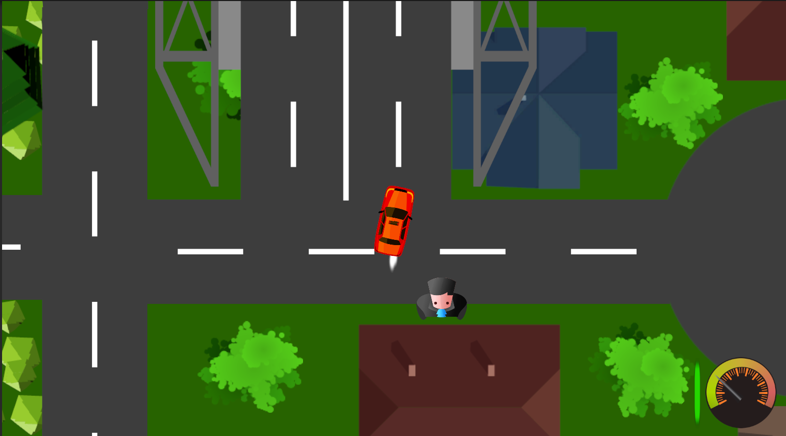
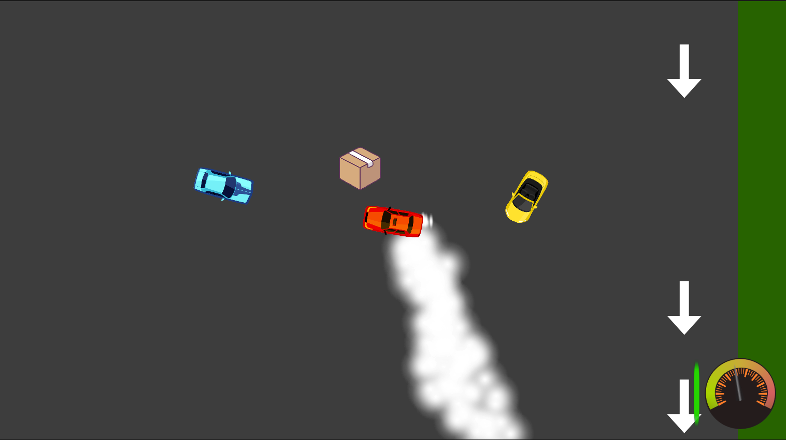
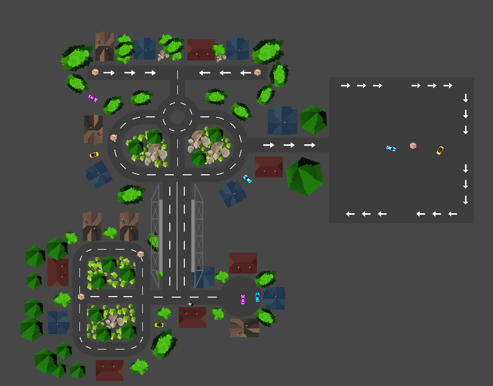

# Delivery Driver

Game project that was made in GameDevTV 2D Course. That project main focus is *interaction between layers* and using **layer collision matrix**.

## Controls

Move Car → Keyboard Arrows

Boost → Left Shift

## Screenshots

